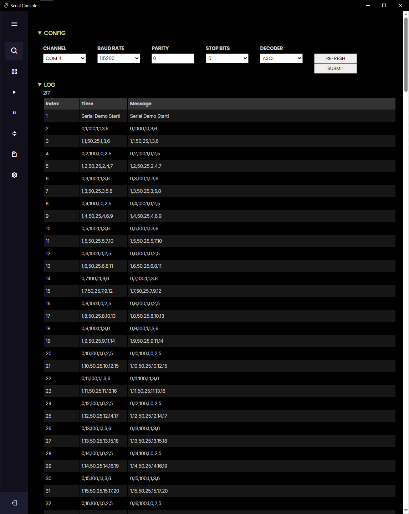

# Tauri Serial Logger

This is a basic Tauri project which reads serial data and logs the data to the frontend. This is an experimental project that is primarily aimed at me playing with the [Tauri][0] framework for desktop apps.

# Screenshot



# Development Usage

To build the application, simply clone the repo, navigate to the src-tauri folder and run build using the standard rust `cargo build` command.

```Rust
cargo tauri dev
```


[0]:https://tauri.app/
